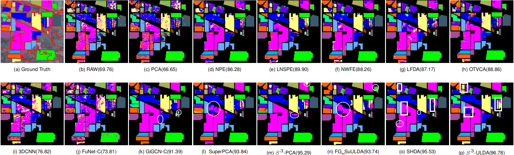
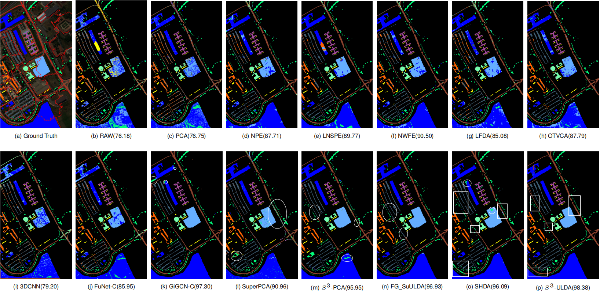

# S3-ULDA
Code for the paper 'Spectral-Spatial and Superpixelwise Unsupervised LDA for Unsupervised Feature Extraction of Hyperspectral Imagery' submitted to TGRS

The three HSIs data used in our paper can be downloaded from the following URLs.

Indian_pines: https://www.ehu.eus/ccwintco/index.php/Hyperspectral_Remote_Sensing_Scenes#Indian_Pines

Pavia University: http://www.ehu.eus/ccwintco/index.php/Hyperspectral_Remote_Sensing_Scenes#Pavia_University_scene

Houston2013: https://hyperspectral.ee.uh.edu/?page_id=459

OAs from the proposed $S^3$-ULDA and some comparative algorithms on three HSIs data with different training data.

OA, AA AND KAPPA OBTAINED BY SEVERAL FEATURE EXTRACTION ALGORITHMS (COMBINED WITH THE SVM CLASSIFIER) 
ON THE INDIAN PINESDATA SET. 

OA, AA AND KAPPA OBTAINED BY SEVERAL FEATURE EXTRACTION ALGORITHMS (COMBINED WITH THE SVM CLASSIFIER) 
ON THE UNIVERSITY OF PAVIA DATA SET.

OA, AA AND KAPPA OBTAINED BY SEVERAL FEATURE EXTRACTION ALGORITHMS (COMBINED WITH THE SVM CLASSIFIER) 
ON THE HOUSTON 2013 DATA SET.

Classification maps of the  Indian Pines from different models.

Classification maps of the University of Pavia from different models.

Classification maps of the Houston 2013 from different models.

