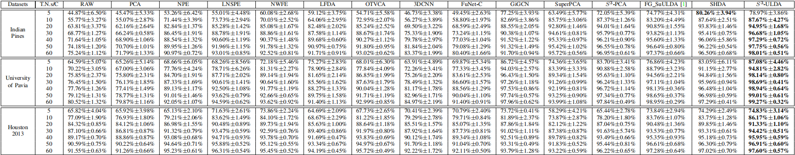
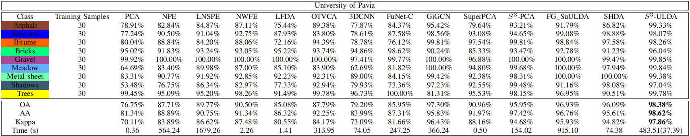
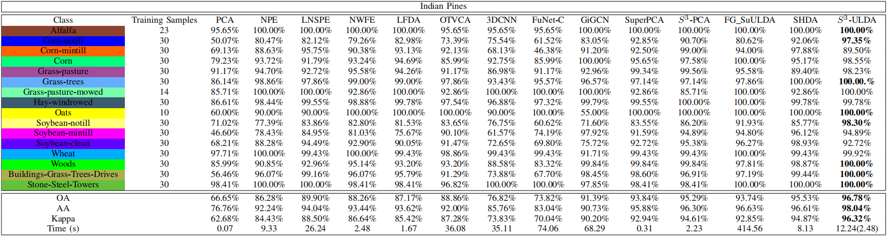

# S3-ULDA
Dimensionality reduction and classification of hyperspectral image based on S3-ULDA
Models are tested on MATLAB R2016a

If you need another dataset (Salinas), please feel free to contact me. Or you can download them from http://www.ehu.eus/ccwintco/index.php/Hyperspectral_Remote_Sensing_Scenes

Salinas: http://www.ehu.eus/ccwintco/uploads/a/a3/Salinas_corrected.mat, http://www.ehu.eus/ccwintco/uploads/f/fa/Salinas_gt.mat

If you need another dataset (Houston 2013), please feel free to contact me. Or you can download them from [http://www.ehu.eus/ccwintco/index.php/Hyperspectral_Remote_Sensing_Scenes](https://hyperspectral.ee.uh.edu/?page_id=459)

OAs from the proposed $S^3$-ULDA and some comparative algorithms on three HSIs data with different training data.

OA, AA AND KAPPA OBTAINED BY SEVERAL FEATURE EXTRACTION ALGORITHMS (COMBINED WITH THE SVM CLASSIFIER) 
ON THE INDIAN PINESDATA SET. 

OA, AA AND KAPPA OBTAINED BY SEVERAL FEATURE EXTRACTION ALGORITHMS (COMBINED WITH THE SVM CLASSIFIER) 
ON THE UNIVERSITY OF PAVIA DATA SET.

OA, AA AND KAPPA OBTAINED BY SEVERAL FEATURE EXTRACTION ALGORITHMS (COMBINED WITH THE SVM CLASSIFIER) 
ON THE HOUSTON 2013 DATA SET.

Classification maps of the Houston 2013 from different models.

